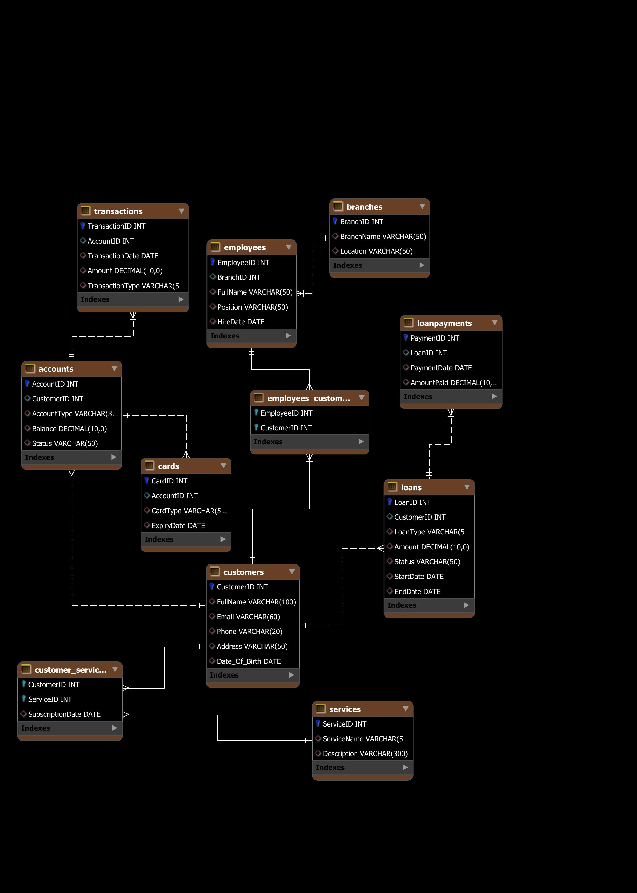
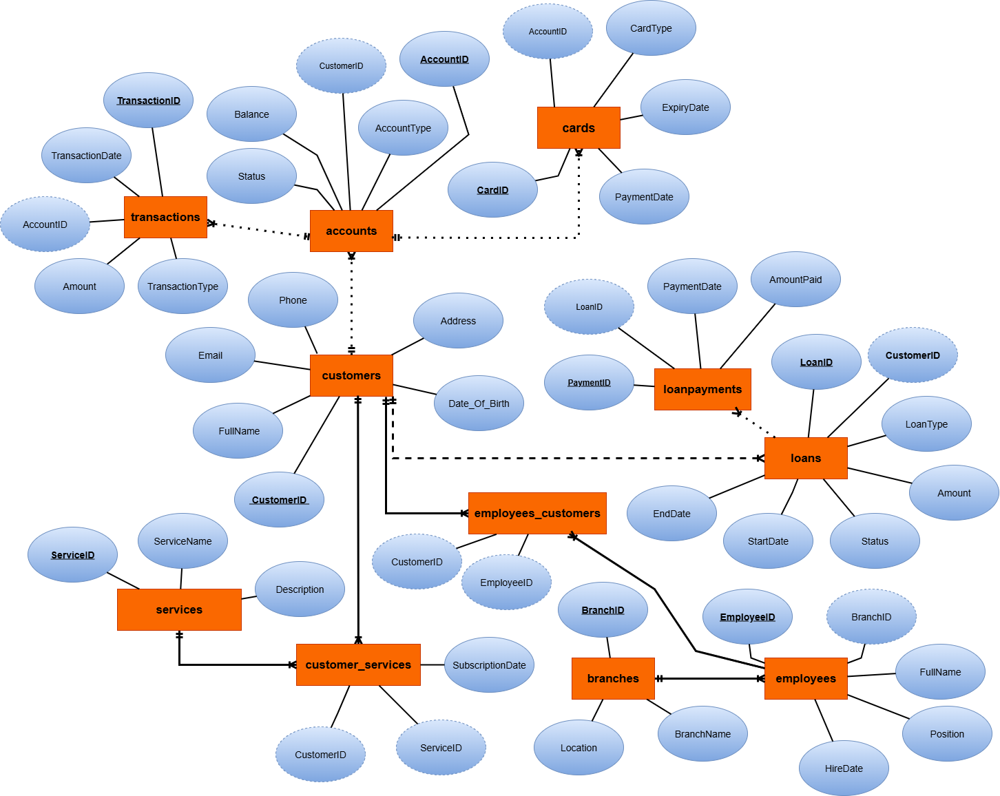

# 🏦 Bank Management Database with Excel Import Tool  

**A robust MySQL-based bank management system with seamless Excel data import functionality.**  

  
  
  

---

## 📌 Overview  
A complete bank database solution featuring:  
✔️ **MySQL schema** for accounts, customers, and transactions.  
✔️ **Python-powered Excel importer** to migrate `.xlsx` data directly into MySQL.  
✔️ **Sample datasets & ERD** for easy setup and visualization.  

---

## 🚀 Features  
### 🗄️ Database Schema  
- Tables for `customers`, `accounts`, `transactions`, `loans`,`etc..`.  
- Foreign key relationships for data integrity.  

### 📊 Excel Import Tool  
- Import `.xlsx` files into MySQL with **2 lines of Python**.  
- Supports bulk inserts and data validation.  

### 📐 ERD Diagram  
 
 

---

## ⚙️ Setup Guide  

### Prerequisites  
- MySQL Server 8.0+  
- Python 3.8+  
- Libraries: `pandas`, `mysql-connector-python`  

### Installation  
1. **Clone the repo**  
   ```bash
   git clone https://github.com/kira924/BankDB-Excel2MySQL.git
   cd BankDB-Excel2MySQL
   ```

2. **Set up the database**  
   - Run the SQL script in MySQL Workbench:  
     ```sql
     TablesCreation&InsertionQueries.sql
     ```

3. **Install Python dependencies**  
   ```bash
   pip install pandas mysql-connector-python
   ```

4. **Import Excel data**  
   ```bash
   excel_to_mysql.py
   ```
   *(Follow the prompts to enter your MySQL credentials and select the Excel file.)*

---

## 📂 Project Structure  
```plaintext
Bank-Management-Database/
├── TablesCreation&InsertionQueries.sql       # Database schema script
├── excel_to_mysql.py                         # Excel-to-MySQL importer
├── BankDataBase_DEPI_Project-V2.0.ipynb      # Excel-to-MySQL importer in a notebook 
├── Business_Analysis_Queries.sql             # For Business_Analysing
├── Schema.png                                # Entity Relationship Diagram
├── ERD.png                                   # Entity Relationship Diagram
└── README.md                                 # You are here
```

---

## 🔧 Troubleshooting  
- **MySQL Connection Issues**: Verify credentials and ensure the server is running.  
- **Excel Import Errors**: Check column names match the database schema.  

---

## 🌟 Future Improvements  
- Web-based dashboard (Flask/Django).  
- Automated report generation.  

---

## 🤝 Contribute  
Pull requests welcome! For major changes, open an issue first.  

---

## 📬 Contact  
**Developer**: Khaled Abdulrahman  
**GitHub**: [kira924](https://github.com/kira924)  
**LinkedIn**: www.linkedin.com/in/khalid-abdulrahman  

